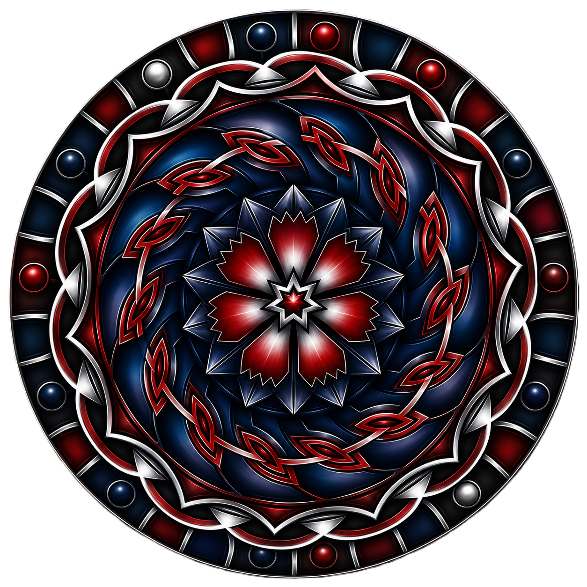

# SunSystem ☀️

Aplicación web 3D interactiva del Sistema Solar y la esfera celeste, con física
orbital realista, un planetario, cartas de constelaciones y un histórico de
misiones espaciales.

## Secciones de la aplicación

SunSystem se compone de varias páginas (multi-página Vite) accesibles desde la
barra lateral **colapsable** (solo iconos; se expande al pasar el ratón) o desde
la barra superior, donde el título **SunSystem** queda centrado. Cada sección usa
iconos Lucide coherentes entre la barra lateral y su página.

- **Sistema Solar 3D** (`index.html`) — simulación principal con Three.js: Sol,
  8 planetas, Luna, 4 lunas galileanas de Júpiter y Titán, cinturón de
  asteroides y anillos de Saturno. Incluye:
  - *Panel de datos* (botón **Datos**): propiedades de cualquier cuerpo al hacer click.
  - *Luna* (botón **Luna**): fases de la Luna con visor (vídeo real de la NASA) y
    galería de fotos reales. Es una página aparte; el botón **SunSystem** (arriba,
    centrado) vuelve a la pantalla principal.
  - *Estadísticas* (botón **Estadísticas**): datos estadísticos de los cuerpos, con
    leyenda fija. También es página aparte.
  - Controles de tiempo (pausa, velocidad exponencial, líneas orbitales, etiquetas).
- **Planetario** (`planetario.html`) — cúpula celeste en vista de observador:
  estrellas, constelaciones y objetos de cielo profundo proyectados en la esfera.
  Permite elegir la provincia española (Madrid por defecto) para ajustar el horizonte.
- **Constelaciones** (`constelaciones.html`) — cartas de las 88 constelaciones con
  figura SVG editable (arrastrar estrellas + deslizador de expansión + restablecer)
  y un panel **Referencia real** con una foto de campo estelar de la constelación.
- **Misiones** (`misiones.html`) — histórico de misiones espaciales reales
  (tripuladas, no tripuladas y estaciones), ordenadas cronológicamente, con
  tripulación, objetivos, resultado, detalles y una foto propia de cada misión.
  Incluye la ISS y misiones fallidas. Buscador rápido por nombre, agencia o astronauta.
- **Catástrofes** (`catastrofes.html`) — fenómenos estelares violentos: supernovas,
  agujeros negros y estrellas de neutrones, con fichas detalladas.
- **Cuerpos menores** (`cuerpos-menores.html`) — enanas blancas, cometas y asteroides:
  los restos y escombros del Sistema Solar, con fichas detalladas.
- **Acerca De** (`acercade.html`) — información del proyecto y enlace a la licencia.

## Características

- **Física real:** órbitas elípticas con las leyes de Kepler (elementos orbitales NASA/JPL).
- **Sistema completo:** Sol + 8 planetas + Luna + lunas galileanas + Titán.
- **Cinturón de asteroides** procedural y **anillos de Saturno** con scattering.
- **Fondo estelar / cúpula:** ~2850 estrellas reales (catálogo HYG) + constelaciones + cielo profundo.
- **Iluminación PBR:** materiales físicamente correctos + glow solar.
- **Cámara orbital libre:** rotar, zoom, paneo, fly-to con click.
- **Planetario interactivo** con selección de localización (provincias de España).
- **Cartas de constelaciones editables** con referencia fotográfica real.
- **Histórico de misiones** con fotos y buscador.
- **Catástrofes estelares** (supernovas, agujeros negros, estrellas de neutrones) con fichas.
- **Cuerpos menores** (enanas blancas, cometas, asteroides) con fichas.
- **Sección Acerca De** con información del proyecto y enlace a la licencia.
- **Barra lateral colapsable** (solo iconos; se expande al pasar el ratón) con iconos Lucide coherentes entre secciones.
- **Control de tiempo:** slider exponencial, pausa, atajos de teclado.

## Stack

| Capa | Tecnología |
|------|-----------|
| Motor 3D | Three.js r169 |
| Lenguaje | TypeScript 5 (strict) |
| Bundler | Vite 5 (multi-página) |
| Datos | JSON en `src/data/` |
| Texturas | Solar System Scope (CC BY 4.0) / NASA Visible Earth |

## Instalación

- **Para usuarios de Windows (64 Bits) tenéis el instalador actualizado ejecutable disponible en la sección Release o pulsando directamente:** [SunSystem.Setup.0.1.0.exe](https://github.com/kraso/SunSystem/releases/download/v0.1.0/SunSystem.Setup.0.1.0.exe)

- **Para usuarios de Linux** hay tres formatos (generados automáticamente por CI y disponibles en la sección Release):
  - **`.deb` (Debian, Ubuntu y derivados):** [SunSystem-0.1.0.deb](https://github.com/kraso/SunSystem/releases/download/v0.1.0/SunSystem-0.1.0.deb) → `sudo apt install ./SunSystem-0.1.0.deb`
  - **`.rpm` (Fedora, RHEL, openSUSE):** [SunSystem-0.1.0.rpm](https://github.com/kraso/SunSystem/releases/download/v0.1.0/SunSystem-0.1.0.rpm) → `sudo dnf install ./SunSystem-0.1.0.rpm`
  - **`.AppImage` (cualquier distribución, sin instalar):** [SunSystem-0.1.0.AppImage](https://github.com/kraso/SunSystem/releases/download/v0.1.0/SunSystem-0.1.0.AppImage) → `chmod +x SunSystem-0.1.0.AppImage && ./SunSystem-0.1.0.AppImage`

  > Nota: en Debian/Ubuntu recientes, el AppImage puede requerir `libfuse2`
  > (`sudo apt install libfuse2`). La aplicación necesita WebGL (drivers GPU funcionales).

- **Para compilar los paquetes Linux desde el código fuente** (el `.rpm` solo se puede generar en Linux, no en Windows):

```bash
cd SunSystem
npm ci
npm run dist:linux   # genera dist/SunSystem-0.1.0.deb, SunSystem-0.1.0.rpm y SunSystem-0.1.0.AppImage
```

- **Para acceder al código fuente:**

```bash
cd SunSystem
npm install
```

## Desarrollo

```bash
npm run dev        # Servidor de desarrollo (http://127.0.0.1:5173)
npm run build      # Build de producción
npm run preview    # Previsualizar build
npm test           # Tests unitarios (vitest)
npm run lint       # TypeCheck
```

## Controles (Sistema Solar 3D)

| Acción | Tecla / Ratón |
|--------|---------------|
| Rotar cámara | Click izquierdo + arrastrar |
| Zoom | Rueda del ratón |
| Panear | Click derecho + arrastrar |
| Pausa / Reanudar | Espacio |
| Acelerar | + |
| Decelerar | - |
| Reset velocidad | 0 |
| Ver info del cuerpo | Click en el planeta/luna |

## Estructura del Proyecto

```
SunSystem/
├── index.html              # Sistema Solar 3D (principal)
├── luna.html               # Luna (fases + visor NASA + galería)
├── estadisticas.html       # Estadísticas de los cuerpos
├── planetario.html         # Planetario (cúpula celeste)
├── constelaciones.html     # Cartas de constelaciones
├── misiones.html           # Histórico de misiones
├── catastrofes.html        # Catástrofes estelares
├── cuerpos-menores.html    # Cuerpos menores
├── acercade.html           # Acerca De
├── licencia.html           # Licencia MIT
├── src/
│   ├── main.ts             # Bootstrap de la simulación 3D
│   ├── luna-app.ts         # Lógica de la sección Luna
│   ├── estadisticas-app.ts # Lógica de la sección Estadísticas
│   ├── planetario-app.ts   # Lógica del Planetario
│   ├── constelaciones-app.ts
│   ├── misiones-app.ts
│   ├── catastrofes-app.ts
│   ├── cuerpos-menores-app.ts
│   ├── acercade-app.ts
│   ├── core/               # Motor de simulación (Kepler, órbitas, tiempo)
│   ├── rendering/          # Renderer WebGL + materiales PBR
│   ├── scene/              # Objetos de escena (cuerpos, anillos, estrellas)
│   ├── camera/             # Cámara orbital + observador
│   ├── input/              # Mouse, teclado, raycasting
│   ├── ui/                 # HUD, paneles (info, Luna, estadísticas), controles
│   ├── data/               # Datos astronómicos (JSON)
│   └── utils/              # Helpers matemáticos
├── assets/
│   ├── constellation-photos/     # Fotos de referencia de constelaciones (en repo)
│   ├── constellation-photos-v2/  # Banco reserva (NO se sube al repo, ver .gitignore)
│   ├── mission-photos/           # Fotos de las misiones (en repo)
│   ├── constellation-charts/     # Cartas SVG generadas
│   ├── photos/  textures/  videos/   # photos/ incluye luna-1..3.jpg (fotos de respaldo de la Luna)
├── scripts/                # Scripts de automatización (Python)
├── docs/                   # Documentación + plan de desarrollo
└── tests/                  # Tests unitarios
```

## Datos (`src/data/`)

Fuentes verificadas, sin hardcodear en el código:

- `celestial-bodies.json` — cuerpos del Sistema Solar (elementos orbitales NASA/JPL).
- `constellations.json` — líneas de las 88 constelaciones (catálogo IAU).
- `stars.json` — catálogo estelar HYG (Hipparcos) filtrado a magnitud ≤ 5.5.
- `constellation-info.json` — estrellas notables y objetos de cielo profundo por constelación.
- `deep-sky.json` — objetos de cielo profundo (galaxias, nebulosas, cúmulos).
- `eclipses.json` — datos de eclipses.
- `missions.json` — misiones espaciales (incluye `image` con la foto en `mission-photos/`).
- `spanish-provinces.json` — provincias de España para el Planetario.

## Scripts de automatización (`scripts/`)

Descarga y generación de datos desde fuentes abiertas:

- `gen_constellation_charts.py` — genera las cartas SVG de las constelaciones.
- `fetch_constellation_photos.py` — fotos de constelaciones desde NASA Images API.
- `fetch_commons_photos.py` — fotos de constelaciones desde Wikimedia Commons.
- `fetch_better_photos.py` — reemplaza fotos no válidas por campo estelar (NASA/Commons).
- `fetch_survey_photos.py` — campo estelar DSS2 por coordenadas (Aladin HiPS2FITS) para constelaciones sin astrofoto.
- `fetch_mission_photos.py` — fotos de cada misión desde Wikimedia Commons.
- `fetch_astro_photos.py` — fotos astronómicas generales (NASA).
- `process_sky_data.py` — procesado de datos de catálogos.

> Nota: `assets/constellation-photos-v2/` es un banco reserva y está excluido del
> repositorio en `.gitignore` (`assets/constellation-photos-v2/`).

## Texturas

Las texturas planetarias se descargan por separado. Fuentes recomendadas:
- [Solar System Scope](https://www.solarsystemscope.com/textures/) (CC BY 4.0)
- [NASA Visible Earth](https://visibleearth.nasa.gov/) (dominio público)

Colocar en `assets/textures/` con los nombres esperados (ver `src/data/celestial-bodies.json`).
Sin texturas, los planetas se muestran con colores sólidos (funcionalidad completa, menos realismo).

## Licencia

MIT

<div style="text-align: left">
  
</div>
